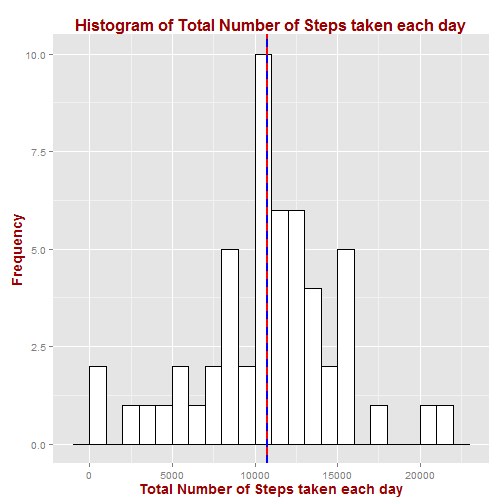
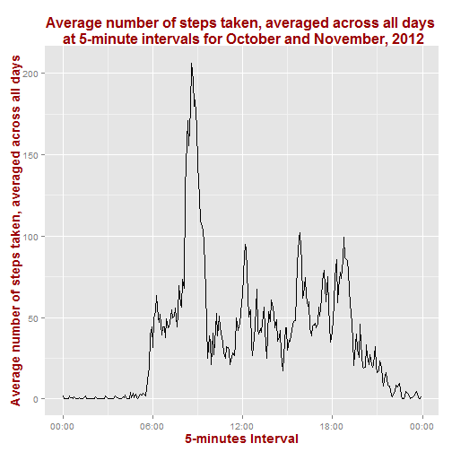
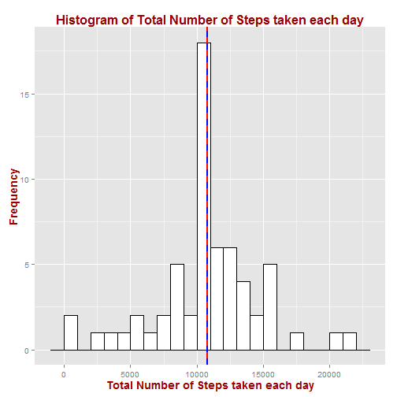
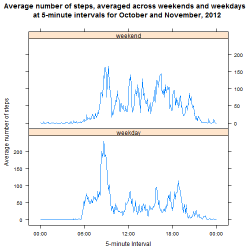

Reprodcible Research: Project 1
================================================

This assignment uses data collected from a personal activity monitoring device to answer certain questions about the data and produce a reproducible report about the same. 

### Data

The data consists of two months of data from an anonymous individual collected during the months of October and November, 2012 and include the number of steps taken in 5 minute intervals each day.

There around 17568 observations of 3 variables, namely:
- steps
- date
- interval

### Load and preprocess the data


```r
library(ggplot2)
library(scales)
library("lattice")

df = read.csv("activity.csv")
```

```
## Error: cannot open the connection
```

```r
df$date <- as.Date(df$date, format = "%Y-%m-%d")  # Format date strings to Date format

# First few lines of the dataset df after preprocessing
head(df)
```

```
##   steps       date interval
## 1    NA 2012-10-01        0
## 2    NA 2012-10-01        5
## 3    NA 2012-10-01       10
## 4    NA 2012-10-01       15
## 5    NA 2012-10-01       20
## 6    NA 2012-10-01       25
```


### Mean total number of steps taken each day

Aggregate the total number of steps taken each day by `date` variable using FUN = sum.


```r
df_withoutNA<-na.exclude(df)                                                    # Create a new dataset excluding the NAs
d<-aggregate(df_withoutNA$steps,                                                # Aggregate data by date             
              by = list(Date = format(df_withoutNA$date, '%Y-%m-%d')),
              FUN = sum, 
              na.rm=TRUE)

colnames(d)[2]<-"steps"                                                         # rename second column as 'steps'
```


Plot a histogram of the total number of steps taken each day with red solid line for mean and blue dashe line for the median of the distribution.


```r
ggplot(d, aes(x=steps)) + 
    geom_histogram(binwidth=1000, 
                   colour="black", 
                   fill="white") +
    ylab("Frequency") +                                                              # y axis label
    xlab("Total Number of Steps taken each day") +                                   # x axis label
    ggtitle("Histogram of Total Number of Steps taken each day") +                   # plot title 
    theme(plot.title = element_text(face = "bold", colour="#990000",size=16),        # plot title text font
           axis.title.x = element_text(face="bold", colour="#990000", size=14),      # x axis text font
           axis.title.y = element_text(face="bold", colour="#990000", size=14)) +    # y axis text font
    geom_vline(aes(xintercept=mean(steps, na.rm=T)),                                 # Ignore NA values for mean
               color="red", 
               linetype="solid", 
               size=1) + 
    geom_vline(aes(xintercept=median(steps, na.rm=T)),                               # Ignore NA values for median
               color="blue", 
               linetype="dashed", 
               size=1)
```

 


```r
df.mean <- mean(d$steps)
```

Mean of total steps taken per day, `df.mean` = 1.0766 &times; 10<sup>4</sup>


```r
df.median <- median(d$steps)
```

Median of total steps taken per day, `df.median` = 10765

The distribution seems to be a normal distribution with mean and median of the distribution approximately equal to each other.

### Average Daily Activity Pattern

Make a time series plot (i.e. type = "l") of the 5-minute interval (x-axis) and the average number of steps taken, averaged across all days (y-axis)

Aggregate the total number of steps taken each day by `interval` variable using FUN = mean.


```r

interval.mean<-aggregate(as.numeric( as.character( df$steps ) ) ,
               by = list(interval = as.factor(df$interval)),
               FUN = mean, 
               na.rm=TRUE)

colnames(interval.mean)[2]<-"steps"                                           # rename second column as 'steps'

# Save interval as POSIXct in a new column
interval.mean$timeOfTheDay <- as.POSIXct(strptime(sprintf("%04d", as.numeric(as.character(interval.mean$interval))), "%H%M"))

head(interval.mean)                                                             
```

```
##   interval   steps        timeOfTheDay
## 1        0 1.71698 2014-11-09 00:00:00
## 2        5 0.33962 2014-11-09 00:05:00
## 3       10 0.13208 2014-11-09 00:10:00
## 4       15 0.15094 2014-11-09 00:15:00
## 5       20 0.07547 2014-11-09 00:20:00
## 6       25 2.09434 2014-11-09 00:25:00
```

```r

ggplot(interval.mean, aes(timeOfTheDay,steps)) + geom_line(aes(group=1)) +
  scale_x_datetime(labels = date_format("%H:%M")) +                           # display x label in required format
  xlab("5-minutes Interval") + 
  ylab("Average number of steps taken, averaged across all days") + 
  ggtitle("Average number of steps taken, averaged across all days \n at 5-minute intervals for October and November, 2012") +
  theme(plot.title = element_text(face = "bold", colour="#990000",size=16),       # plot title text font
           axis.title.x = element_text(face="bold", colour="#990000", size=14),   # x axis text font
           axis.title.y = element_text(face="bold", colour="#990000", size=14))   # y axis text font
```

 


5-minute interval, on average across all the days in the dataset, that contains the maximum number of steps can be obtained as follows:


```r
interval.mean[interval.mean$steps == max(interval.mean$steps), c("interval", 
    "steps")]
```

```
##     interval steps
## 104      835 206.2
```


### Imputing missing values

Total number of missing values in the dataset (i.e. the total number of rows with NAs) can be calculated as:


```r
nrow(df[is.na(df$steps), ])
```

```
## [1] 2304
```


Total number of rows with NAs is 2304  

Substitute all NAs for steps with the mean steps for that interval and create a new dataset:


```r
df.complete <- df
for(row in 1:length(df.complete$steps)) {                            # Loop through each row of the dataset
    if (is.na(df.complete$steps[row]))                               # check if steps is NA
    {
      interval<-df.complete[row,'interval']                          # get the corresponding interval                  
      m<-interval.mean[interval.mean$interval == interval,'steps']   # check the mean steps for that particular interval
      df.complete$steps[row]<-m                                      # substitute the NA with the mean
    }
}
```


This is how the dataset looks now.


```r
head(df.complete)
```

```
##     steps       date interval
## 1 1.71698 2012-10-01        0
## 2 0.33962 2012-10-01        5
## 3 0.13208 2012-10-01       10
## 4 0.15094 2012-10-01       15
## 5 0.07547 2012-10-01       20
## 6 2.09434 2012-10-01       25
```


### Mean total number of steps taken each day (Imputed)

Aggregate the total number of steps taken each day by `date` variable using FUN = sum.


```r
d.complete<-aggregate(df.complete$steps,                                 # Aggregate data by date 
               by = list(Date = format(df.complete$date, '%Y-%m-%d')),
                FUN = sum, 
                na.rm=TRUE)

colnames(d.complete)[2]<-"steps"                                         # rename second column as 'steps'
```


Plot a histogram of the total number of steps taken each day with red solid line for mean and blue dashe line for the median of the distribution.


```r
ggplot(d.complete, aes(x=steps)) + 
    geom_histogram(binwidth=1000, 
                   colour="black", 
                   fill="white") +
    ylab("Frequency") +                                                              # y axis label
    xlab("Total Number of Steps taken each day") +                                   # x axis label
    ggtitle("Histogram of Total Number of Steps taken each day") +                   # plot title 
    theme(plot.title = element_text(face = "bold", colour="#990000",size=16),        # plot title text font
           axis.title.x = element_text(face="bold", colour="#990000", size=14),      # x axis text font
           axis.title.y = element_text(face="bold", colour="#990000", size=14)) +    # y axis text font
    geom_vline(aes(xintercept=mean(steps)),                                 
               color="red", 
               linetype="solid", 
               size=1) + 
    geom_vline(aes(xintercept=median(steps)),                              
               color="blue", 
               linetype="dashed", 
               size=1)
```

 


```r
df.complete.mean <- mean(d.complete$steps)
```

Mean of total steps taken per day = 1.0766 &times; 10<sup>4</sup>


```r
df.complete.median <- median(d.complete$steps)
```

Median of total steps taken per day = 1.0766 &times; 10<sup>4</sup>

The distribution seems to be little different from the earlier distribution, but the means and medians of the distribution do not change and are approximately equal to each other in both the cases.

### Differences in activity patterns between weekdays and weekends (Imputed)

Create a new factor variable in the dataset with two levels - "weekday" and "weekend" indicating whether a given date is a weekday or weekend day.


```r
df.complete$day <- as.factor(c("weekend", rep("weekday", 5), "weekend")[as.POSIXlt(df.complete$date)$wday + 
    1])

head(df.complete)
```

```
##     steps       date interval     day
## 1 1.71698 2012-10-01        0 weekday
## 2 0.33962 2012-10-01        5 weekday
## 3 0.13208 2012-10-01       10 weekday
## 4 0.15094 2012-10-01       15 weekday
## 5 0.07547 2012-10-01       20 weekday
## 6 2.09434 2012-10-01       25 weekday
```


A panel plot containing a time series plot (i.e. type = "l") of the 5-minute interval (x-axis) and the average number of steps taken, averaged across all weekday days or weekend days (y-axis).

Aggregate the total number of steps taken each day by `day` and `interval` using FUN = mean.


```r

d.complete<-aggregate(df.complete$steps, 
                by = list(day = df.complete$day, interval = as.factor(df.complete$interval)),
                FUN = mean, 
                na.rm=TRUE)

colnames(d.complete)[3] = 'steps'

# Save interval as POSIXct in a new column
d.complete$timeOfTheDay <- as.POSIXct(strptime(sprintf("%04d", as.numeric(as.character(d.complete$interval))), "%H%M"))

xyplot(steps ~ timeOfTheDay | day,
        data = d.complete,
        main = "Average number of steps, averaged across weekends and weekdays \n at 5-minute intervals for October and November, 2012",
        xlab = "5-minute Interval", 
        ylab = "Average number of steps",
        scales = list(x = list(format = "%H:%M")),                        #format the x-axis labels
        layout = c(1,2),
        type = "l")
```

 


